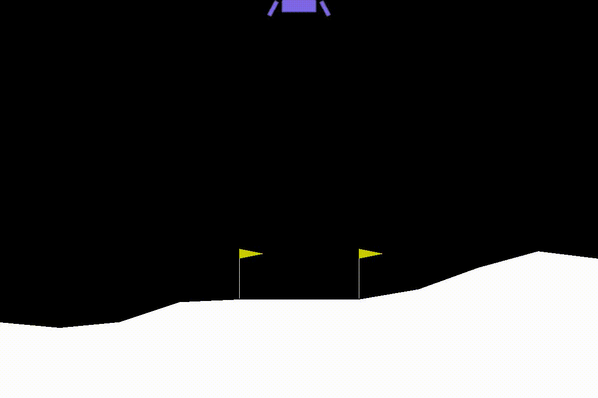
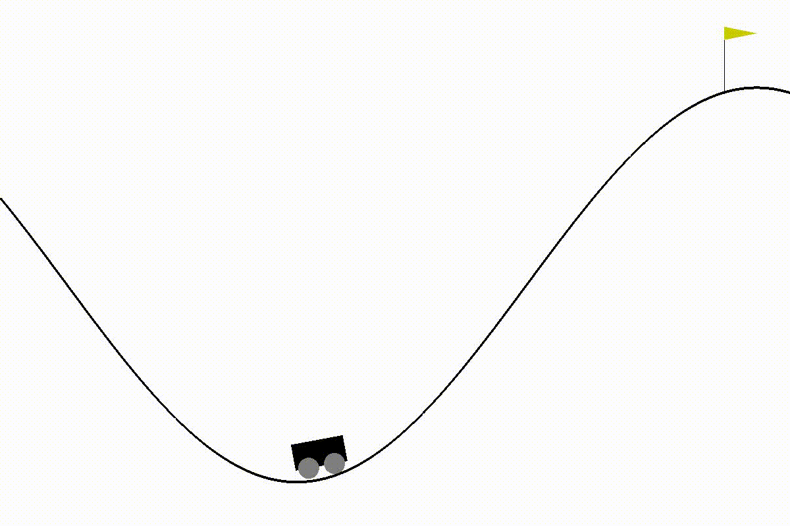
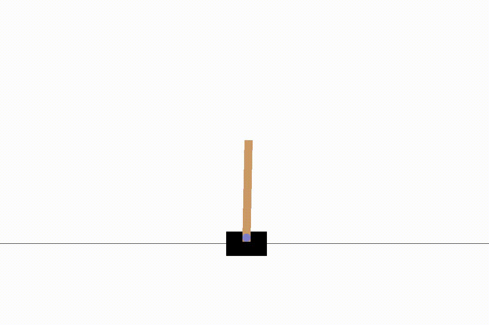
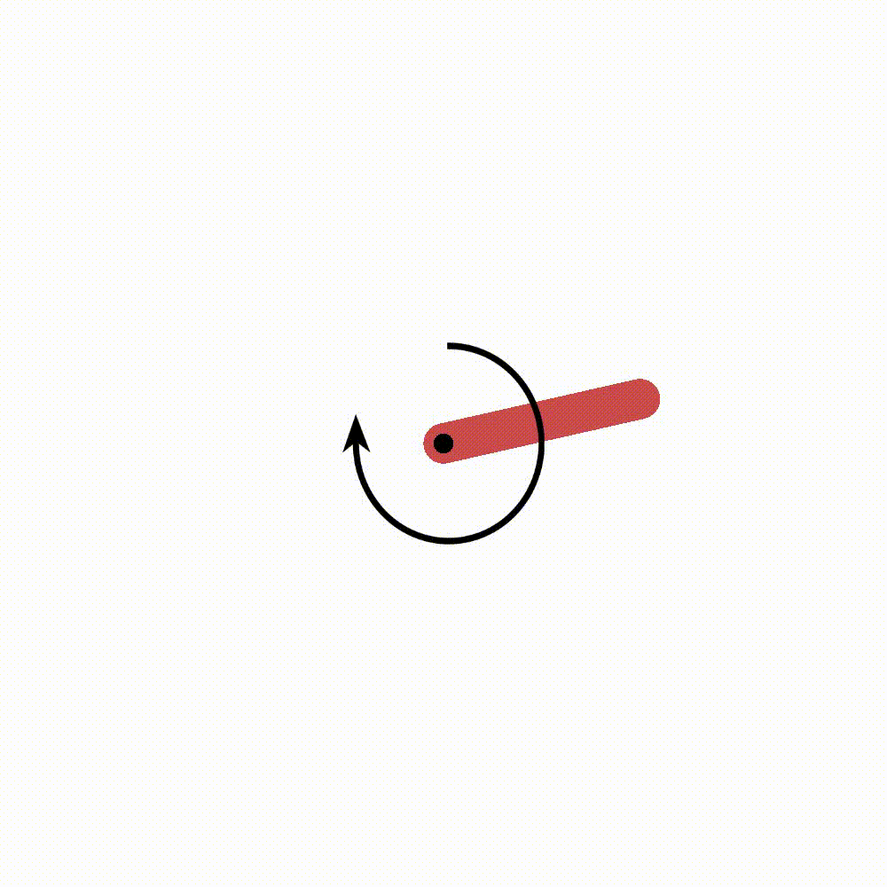

# minimal-rl
RL algorithms with minimal lines of code

## Installation
```console
$ git clone https://github.com/r-salas/minimal-rl.git
$ cd minimal-rl
$ pip install -r requirements.txt
```

## DQN
```console
$ python dqn.py
```


## DDPG
```console
$ python ddpg.py
```


## REINFORCE
```console
$ python reinforce.py
```


## A2C
```console
$ python a2c.py
```


## CEM
```console
$ python cem.py
```

